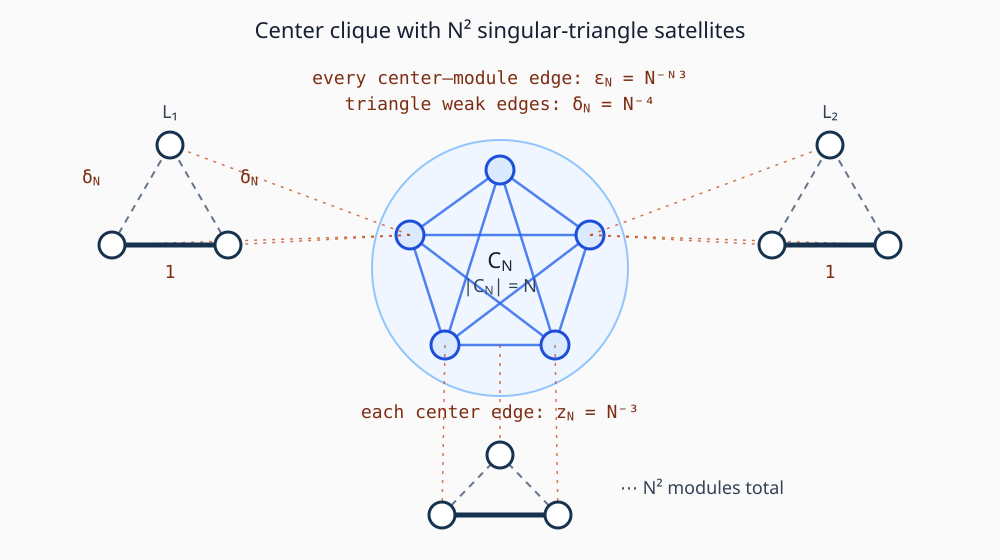

# A simultaneous-amplifier family up to fitness `3/2`

Claim labels in this note are deliberate.  The finite triangle algebra and
the asymptotic theorem below are **PROVED**, including the endpoint
comparison at `r=3/2`.  No universal upper bound is asserted.

## 1. Construction and theorem

For every integer `N>=3`, put

\[
 c_N=N,\qquad M_N=N^2,\qquad
 \delta_N=N^{-4},\qquad z_N=N^{-3},\qquad
 \varepsilon_N=N^{-N^3}.
\]

The graph `G_N` consists of a center set `C_N` of `c_N` vertices and
`M_N` disjoint three-vertex modules.  In module `j`, label the vertices
`A_j,B_j,D_j` and give the edges

\[
 w(A_j,D_j)=1,\qquad
 w(A_j,B_j)=w(B_j,D_j)=\delta_N.
\]

Every two distinct center vertices have edge weight `z_N`.  Every center
vertex and every module vertex have edge weight `epsilon_N`.  There are no
edges between distinct modules.  Thus

\[
 |V(G_N)|=N+3N^2,
\]

all weights are positive rational numbers, and `G_N` is connected.  The
family does not depend on fitness.

**Theorem.**  For each fixed `r>1`,

\[
 \lim_{N\to\infty}\rho_{\rm Bd}(G_N,r)
 =\lim_{N\to\infty}\rho_{\rm dB}(G_N,r)=\frac13. \tag{1}
\]

Consequently, for every fixed `1<r<3/2`, both fixation probabilities on
`G_N` are strictly larger than their complete-graph baselines for all
sufficiently large `N`.  In particular,

\[
 R_{\rm sim}\geq \frac32. \tag{2}
\]

For every fixed `r>=3/2`, this particular family instead suppresses both
rules for all sufficiently large `N`.  At the endpoint the exact leading
comparisons are

\[
\begin{aligned}
 \rho_{\rm Bd}(G_N,3/2)-\rho_{\rm Bd}(K_{|V(G_N)|},3/2)
   &=-\frac{4}{3N^2}+o(N^{-2}),\\
 \rho_{\rm dB}(G_N,3/2)-\rho_{\rm dB}(K_{|V(G_N)|},3/2)
   &=-\frac{16}{81N^2}+o(N^{-2}).
\end{aligned} \tag{2a}
\]

Thus `(1,3/2)` is the exact asymptotic fixed-fitness amplification interval
of this family.  This does not assert that `R_sim=3/2`; another family could
have a larger interval.

## 2. Exact isolated-module calculation

Write `H_delta` for one weighted triangle, and let

\[
 d_A=d_D=1+\delta,\qquad d_B=2\delta. \tag{3}
\]

For `U` in `{Bd,dB}`, let `f^U_v(delta,r)` be fixation in `H_delta`
from a mutant at `v`, and let

\[
 \alpha_U(\delta,r)=\frac13\sum_v f^U_v(\delta,r). \tag{4}
\]

Let `beta^U_v(delta,r)` be fixation of a single resident placed at `v`
in an otherwise mutant module.  Equivalently, it is `f^U_v(delta,1/r)`
after multiplying all fitnesses by `1/r`.

Solving the six transient equations directly gives, with

\[
\begin{aligned}
D_B={}&9r^2
+\delta(12r^4+24r^3+15r^2+24r+12)\\
&+\delta^2(16r^4+52r^3+83r^2+52r+16)\\
&+\delta^3(4r^4+12r^3+13r^2+12r+4),
\end{aligned}
\]

the exact average

\[
 \alpha_{\rm Bd}
 =\frac{r^2\{3+\delta(12r^2+12r+5)
 +\delta^2(16r^2+36r+21)
 +\delta^3(4r^2+8r+3)\}}{D_B}. \tag{5}
\]

For dB,

\[
 \alpha_{\rm dB}
 =\frac{2r\{r+1+\delta(3r^2+3r+1)+\delta^2(5r+1)\}}
 {3(r+1)\{2r+\delta(3r^2+r+3)+6\delta^2r\}}. \tag{6}
\]

The quantities needed for invasion in the reverse direction are

\[
 X(\delta):=\sum_v\frac1{d_v}
 =\frac{2}{1+\delta}+\frac1{2\delta}, \tag{7}
\]

\[
\begin{aligned}
 Y_B(\delta,r)&:=\sum_v\beta^{\rm Bd}_v(\delta,r)\\
 &=\frac{3\{3r^2+\delta(5r^2+12r+12)
 +\delta^2(21r^2+36r+16)
 +\delta^3(3r^2+8r+4)\}}{D_B},
\end{aligned} \tag{8}
\]

and

\[
\begin{aligned}
 I_D(\delta,r)&:=\sum_v\frac{\beta^{\rm dB}_v(\delta,r)}{d_v}\\
 &=\frac{2r^2+3r+1+\delta(3r^2+7r+5)+\delta^2(r^2+8r)}
 {(1+\delta)(r+1)\{2r+\delta(3r^2+r+3)+6\delta^2r\}}.
\end{aligned} \tag{9}
\]

The exact rational expressions (5)--(9) are independently regenerated and
checked by `verify_triangle_module.py`.  Directly from them,

\[
\begin{aligned}
 \alpha_{\rm Bd}(\delta,r)&=\frac13+O_r(\delta),
 &Y_B(\delta,r)&=1+O_r(\delta),\\
 \alpha_{\rm dB}(\delta,r)&=\frac13+O_r(\delta),
 &I_D(\delta,r)&=\frac{2r+1}{2r}+O_r(\delta),\\
 2\delta X(\delta)&=1+O(\delta).
\end{aligned} \tag{10}
\]

For the later center-to-module direction, the same exact solution gives

\[
 \sum_v f^{\rm Bd}_v=1+O_r(\delta), \tag{11a}
\]

and, exactly,

\[
 \sum_v\frac{f^{\rm dB}_v}{d_v}
 =\frac{r\{r^2+3r+2+\delta(5r^2+7r+3)+\delta^2(8r+1)\}}
 {(1+\delta)(r+1)\{2r+\delta(3r^2+r+3)+6\delta^2r\}}
 =\frac{r+2}{2}+O_r(\delta). \tag{11b}
\]

All denominators displayed in the verifier have positive coefficients for
`r>0,delta>0`; hence no limiting cancellation or unrecorded sign assumption
is used.

## 3. Center fixation formulas

Let `Q^U_c(r)` be fixation from one mutant in an isolated unit-weight
`K_c`.  The one-dimensional count chain gives

\[
 Q^{\rm Bd}_c(r)=\frac{1-r^{-1}}{1-r^{-c}},\qquad
 \bar Q^{\rm Bd}_c(r)=\frac{r-1}{r^c-1}, \tag{12}
\]

where the bar denotes fixation of one resident in an otherwise mutant
center.  For dB, the adjacent count-transition ratio telescopes:

\[
 \prod_{j=1}^{i}\frac{T_j^-}{T_j^+}
 =\frac{c-1+(r-1)i}{(c-1)r^i}. \tag{13}
\]

Therefore

\[
 Q^{\rm dB}_c(r)
 =\frac{c-1}{c}\frac{1-r^{-1}}{1-r^{-(c-1)}},
 \qquad
 \bar Q^{\rm dB}_c(r)=r^{2-c}Q^{\rm dB}_c(r). \tag{14}
\]

In both rules `Q^U_c(r)->q:=1-1/r`, whereas the barred probability is
exponentially small in `c`.

## 4. A quantitative separation lemma

Only a specialized elementary form is needed here.

**Lemma (rare-edge trace).**  Fix `r>1`.  Suppose a graph on `n` vertices is
partitioned into internally connected components of size at most `s`.  Every
component contains at least two vertices (so every vertex has positive
internal degree), every nonzero internal edge lies in `[a,b]`, and every
outer edge has weight at most `epsilon<=b`.  Start with all components
monomorphic except possibly one.  If

\[
 \eta(n,s,a,b,\varepsilon)
 :=C_r n^4\frac{b\varepsilon}{a^2}
 s\left(\frac{C_r n^2b}{a}\right)^s, \tag{15}
\]

then, during one excursion from a componentwise-monomorphic state to the next
such state, the probability of either a second type-changing outer event
before internal absorption or a discrepancy from the isolated-component
absorption law is at most `eta`.  The laws of the first `L` excursions can be
coupled with the corresponding marked trace chain with error at most
`L eta`.

Here the marked trace chain chooses an outer replacement with its rate in the
componentwise-monomorphic state and marks the replacement by the isolated
fixation probability of the introduced type in the target component.

**Proof.**  In a polymorphic component there is a discordant internal edge.
Under either update rule, one orientation of that edge changes type in the
desired direction in one **global update** with probability at least

\[
 p=\frac{a}{C_r n^2b} \tag{16}
\]

per global update.  The probability of any type-changing outer replacement
in one global update is at most `C_r n epsilon/a`.

From every nonabsorbing configuration, choose adaptively a monotone sequence
of at most `s` replacements along a spanning tree which makes the active
component monomorphic.  The event that the next `s` global updates realize
that sequence (with arbitrary padding after absorption) has probability at
least `p^s`.  Thus, in blocks of `s` global updates, internal absorption has
conditional probability at least `p^s`, and the expected number of global
updates before absorption is at most `s p^{-s}`.  Multiplication by the
per-update outer-event bound controls an intervening outer replacement.

Deleting the outer edges changes a Bd neighbor-choice distribution, or a dB
parent-choice distribution, by total variation at most
`C_r n epsilon/a` in one global update.  Coupling update by update for the
same expected number of global updates controls the discrepancy from the
isolated absorption law.  The resulting bound is smaller than the generous
envelope (15) for `n>=2` and `b>=a`.  Finally, the `L`-excursion statement is
a union bound.  This proves the lemma.  `square`

For `G_N`, take

\[
 n\le4N^2,\quad s=N,\quad a=N^{-4},\quad b=1,
 \quad\varepsilon=N^{-N^3}. \tag{17}
\]

Thus

\[
 \log\eta_N=-N^3\log N+O_r(N\log N), \tag{18}
\]

and in particular `N^K eta_N->0` for every fixed `K`.  This is why the
explicit super-small rational outer weight is more than a heuristic ordering
of timescales.

## 5. From one mutant module to a mutant center

Put

\[
 Z_N=(c_N-1)z_N=(N-1)N^{-3}\sim N^{-2}. \tag{19}
\]

Suppose one module is all mutant and the center and all other modules are
resident.  In the rare-edge trace, the only successful macro changes are
fixation of an introduced mutant in the center and fixation of an introduced
resident in the mutant module.  Failed introductions return to the same
macro state.

For Bd, their successful-rate ratio is

\[
 A_{B,N}
 =\frac{(Z_N+3M_N\varepsilon_N)rQ^{\rm Bd}_{c_N}(r)
 \sum_v(d_v+c_N\varepsilon_N)^{-1}}
 {Y_B(\delta_N,r)}\,[1+o(1)]. \tag{20}
\]

The displayed `o(1)` is covered uniformly by the separation lemma.  Equations
(10), (12), and (19) give

\[
 A_{B,N}\sim\frac{r-1}{2}\frac{Z_N}{\delta_N}
 \sim\frac{r-1}{2}N^2\longrightarrow\infty. \tag{21}
\]

For dB, writing the two successful rates directly gives

\[
\begin{aligned}
 a_{D,N}&=\frac{c_N}{n_N}
 \frac{3r\varepsilon_N}
 {Z_N+3(M_N-1)\varepsilon_N+3r\varepsilon_N}
 Q^{\rm dB}_{c_N}(r),\\
 b_{D,N}&=\frac1{n_N}\sum_v
 \frac{c_N\varepsilon_N}{rd_v+c_N\varepsilon_N}
 \beta^{\rm dB}_v(\delta_N,r).
\end{aligned} \tag{22}
\]

Consequently

\[
 A_{D,N}:=\frac{a_{D,N}}{b_{D,N}}
 \sim\frac{3r(r-1)}{Z_N I_D(\delta_N,r)}
 \sim\frac{6r^2(r-1)}{2r+1}N^2
 \longrightarrow\infty. \tag{23}
\]

The chance that the center is seeded before the mutant module is erased is
`A_{U,N}/(1+A_{U,N})+o(1)`, hence tends to one under both rules.  The number
of outer excursions required is at most `N^10` with probability tending to
one.  Indeed, this stage requires one successful macro change, and the exact
module formulas give success probability per relevant outer introduction at
least `c_r delta_N=c_rN^{-4}` for all large `N`.  Its expected number of
introductions is at most `C_rN^4`, so Markov's inequality bounds the chance of
more than `N^10` by `O_r(N^{-6})`.  Equation (18) therefore justifies use of
the marked trace throughout this stage.

For reference, if `delta->0` and `c->infinity` while the total center degree
`Z` is kept as a free parameter, comparison with `q` gives the transparent
window

\[
 Z>\frac{6\delta}{3-2r}\quad\hbox{for Bd},\qquad
 Z<\frac{2r^2(3-2r)}{2r+1}\quad\hbox{for dB}. \tag{24}
\]

It is nonempty for every fixed `1<r<3/2`.  The chosen scales place `Z_N`
strictly between these bounds eventually.

## 6. From a mutant center to global fixation

Suppose the center is mutant and `R` modules remain resident.  At the next
successful trace transition, either one of those modules becomes mutant or a
resident module reverses the center.  The factor `R` cancels from the ratio.

For Bd, (10)--(12) bound the bad-to-good successful-rate ratio by

\[
 B_{B,N}
 \le C_r Z_N X(\delta_N)\bar Q^{\rm Bd}_{c_N}(r)
 \le C_r N^2r^{-N}. \tag{25}
\]

For dB, (11b), (14), and (19) give

\[
 B_{D,N}
 \le C_r Z_N^{-1}\bar Q^{\rm dB}_{c_N}(r)
 \le C_r N^2r^{2-N}. \tag{26}
\]

There are only `M_N=N^2` successful module conversions.  A union bound in
(25)--(26) shows that center reversal before all modules become mutant has
probability `o(1)`.  Counting every type-changing outer introduction as an
excursion, direct raw-rate comparison gives

\[
\begin{array}{c|cc}
 &\text{module-to-center stage}&\text{center-sweep stage}\\ \hline
 \mathrm{Bd}&c_r&c_rN^{-2}\\
 \mathrm{dB}&c_r\delta_N&c_r\delta_N.
\end{array} \tag{27}
\]

These are lower bounds for the probability that one excursion produces a
successful macro change.  The `N^-2` Bd sweep factor is necessary because
resident-module-to-center introductions are more frequent than favorable
center-to-module introductions by order `N^2`, even though the former almost
always fail to fix in the center.  Since there are `N^2` required
conversions, (27) bounds the expected total number of excursions by
`C_rN^6`.  Markov's inequality gives

\[
 \Pr\{\hbox{more than }N^{10}\hbox{ introductions}\}
 \le C_rN^{-4}=o(1). \tag{28}
\]

The separation error over those introductions remains `o(1)` by (18).
Therefore a mutant center leads to global fixation with probability tending
to one.

## 7. Uniform initialization and comparison

The initial mutant lies in the center with probability

\[
 \frac{N}{N+3N^2}=O(N^{-1}). \tag{29}
\]

Otherwise it is uniformly distributed over the three vertices of one
module.  Before an outer replacement occurs, that module follows its isolated
chain up to an `o(1)` error.  It fixes internally with probability
`alpha_U(delta_N,r)=1/3+o(1)`.  Conditional on internal fixation, Sections 5
and 6 give global fixation with probability `1-o(1)`; conditional on internal
extinction there are no mutants.  This proves (1).

Finally, for both update rules on `K_n`, direct count-chain formulas give

\[
 \rho_U(K_n,r)\longrightarrow 1-\frac1r. \tag{30}
\]

For `1<r<3/2`,

\[
 \frac13-\left(1-\frac1r\right)=\frac{3-2r}{3r}>0. \tag{31}
\]

Convergence in (1) and (30) therefore implies both strict finite-`N`
inequalities for every sufficiently large `N`, completing the proof.

## 8. The endpoint `r=3/2`

It remains to justify the endpoint assertion (2a), including errors below the
`N^-2` scale.  Use the `N^10`-excursion coupling of Sections 4--6.  The two
Markov tails are `O(N^-6)` and `O(N^-4)`, its trace-coupling error is at most
`N^10 eta_N`, and the union bound for center reversal is
`O_r(N^4r^{-N})`.  Hence the complement of the coupled direct path has
probability at most

\[
 O_r(N^{-4})+N^{10}\eta_N+O_r(N^4r^{-N})=o(N^{-2}). \tag{32}
\]

This estimate also applies to a center start: before the first outer change,
the center reaches one of its two monomorphic states except on a trace error;
conditional on center fixation, the sweep fails only by the last two terms in
(32).  Thus no untracked event can affect an order-`N^-2` coefficient.

Now put `q=1/3`.  Equations (5)--(10) give

\[
 \alpha_{\rm Bd}(\delta_N,3/2)=q+O(N^{-4}),\qquad
 \alpha_{\rm dB}(\delta_N,3/2)=q+O(N^{-4}). \tag{33}
\]

The two first-stage odds in (20) and (23) sharpen to

\[
 A_{B,N}=\frac14N^2(1+o(1)),\qquad
 A_{D,N}=\frac{27}{16}N^2(1+o(1)). \tag{34}
\]

Let `p_{U,N}` be global fixation from a uniformly chosen singleton in one
module and `q_{U,N}` global fixation from a uniformly chosen center
singleton.  The marked renewal chain gives, with the error controlled by
(32),

\[
 p_{U,N}=\alpha_U(\delta_N,3/2)
 \frac{A_{U,N}}{1+A_{U,N}}+o(N^{-2}).
\]

Consequently, (33)--(34) give

\[
 p_{B,N}=q-\frac{4}{3N^2}+o(N^{-2}),\qquad
 p_{D,N}=q-\frac{16}{81N^2}+o(N^{-2}). \tag{35}
\]

A center singleton first fixes in the isolated center, after which the sweep
succeeds with probability `1-o(N^-2)` by (32).  Therefore

\[
 q_{B,N}=Q^{\rm Bd}_N(3/2)+o(N^{-2})=q+o(N^{-2}),
 \tag{36a}
\]

\[
 q_{D,N}=Q^{\rm dB}_N(3/2)+o(N^{-2})
 =q-\frac{q}{N}+o(N^{-2}). \tag{36b}
\]

Since the uniform initial center mass is
`h_N=N/(N+3N^2)=1/(3N+1)`, uniform initialization is exactly

\[
 \rho_U(G_N,3/2)=(1-h_N)p_{U,N}+h_Nq_{U,N}. \tag{37}
\]

Substitution of (35)--(36) yields

\[
 \rho_{\rm Bd}(G_N,3/2)
 =q-\frac{4}{3N^2}+o(N^{-2}), \tag{38}
\]

and

\[
 \rho_{\rm dB}(G_N,3/2)
 =q-\left(\frac{16}{81}+\frac19\right)N^{-2}+o(N^{-2})
 =q-\frac{25}{81N^2}+o(N^{-2}). \tag{39}
\]

For `n=N+3N^2`, the complete-graph formulas give

\[
 \rho_{\rm Bd}(K_n,3/2)=q+o(N^{-2}),\qquad
 \rho_{\rm dB}(K_n,3/2)=q-\frac1{9N^2}+o(N^{-2}). \tag{40}
\]

Subtracting (40) from (38)--(39) proves (2a).  For every fixed `r>3/2`,
(1) and `1-1/r>1/3` already give eventual strict suppression under both
rules.  Hence the stated interval for this family is exact.
